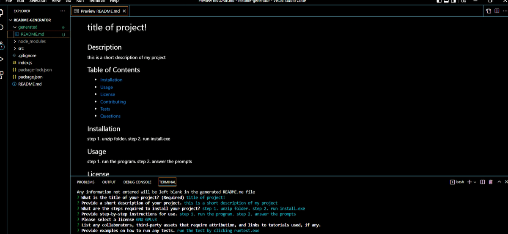

# README-generator
## Description

This program makes it easy to generate a README markdown file in proper format which can then be further edited for a professional README.md project file.

## Table of Contents

- [Installation](#installation)
- [Usage](#usage)
- [License](#license)
- [Contributing](#contributing)
- [Tests](#tests)
- [Questions](#questions)

## Installation

1. Make sure you have downloaded and installed [node.js](https://nodejs.org/en/download/)
2. Download a .zip of this repository, or clone the repository into a new directory using Git.
3. Open a terminal window in the location of the extracted or cloned files and run ```node install``` to ensure the necessary packages will be included. You should see a new folder called "node_modules" appear in the directory.

## Usage

1. Type ```node index``` into your command line shell and press Enter to run README-generator.
2. Answer the prompts in the terminal window.
3. Your generated README.md file will appear in the "generated" folder inside your directory.

Watch a brief video demonstrating usage:

[](https://drive.google.com/file/d/1HnTRWu_vlVyA_FlmjthET_7LaP6LzG6m/view)

## License

[](https://opensource.org/licenses/MIT)

## Contributing

License badge links created with reference [https://gist.github.com/lukas-h/2a5d00690736b4c3a7ba](https://gist.github.com/lukas-h/2a5d00690736b4c3a7ba)

Professional readme template based on [https://coding-boot-camp.github.io/full-stack/github/professional-readme-guide](https://coding-boot-camp.github.io/full-stack/github/professional-readme-guide)

## Questions

I am on GitHub: [https://github.com/chardmuffin](https://github.com/chardmuffin)

I can also be reached by email at [richardhuffman96@gmail.com](mailto:richardhuffman96@gmail.com)